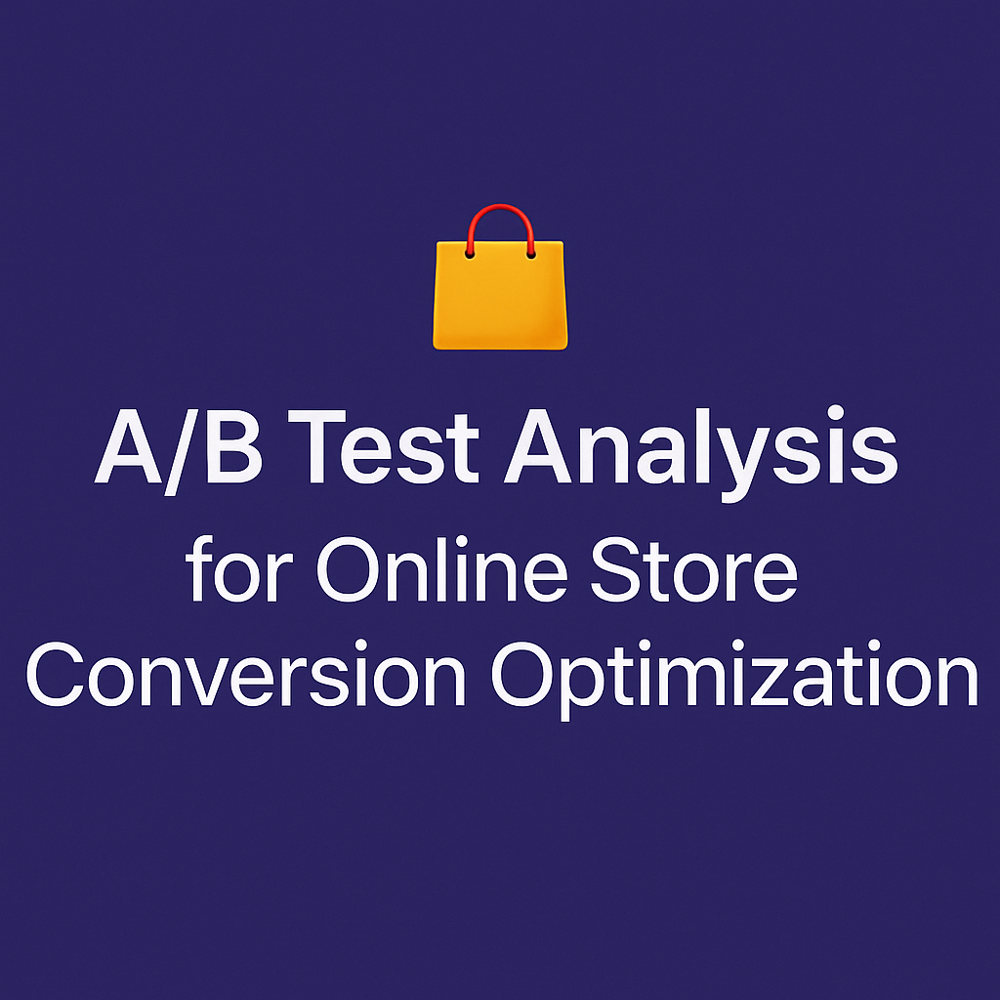

# 🛍️ A/B Test Analysis for Online Store Conversion Optimization

This project analyzes the results of an A/B experiment conducted by an online store. The goal is to evaluate business hypotheses and identify the most effective strategy for improving user conversion and revenue metrics.

## 📌 Project Objective

To evaluate multiple business hypotheses and analyze A/B test results in order to make data-driven decisions that improve the performance of an online store.

## 📁 Project Structure

1. **Data Loading and Review**  
   - Business hypotheses  
   - Visitor and order data for groups A and B

2. **Data Preprocessing**  
   - Date formatting  
   - Detection of duplicates and anomalies

3. **Exploratory Data Analysis**  
   - Cumulative metric visualization  
   - Order and revenue distribution

4. **Statistical Testing**  
   - Mann-Whitney U tests for comparing revenue and conversion rates  
   - Evaluation of statistical significance

5. **Conclusions and Recommendations**  
   - Identification of the most promising hypothesis  
   - Decision on whether to implement changes based on test results

## 🧰 Tools Used

- Python  
- Pandas  
- Matplotlib  
- Scipy  
- NumPy  
- Jupyter Notebook
